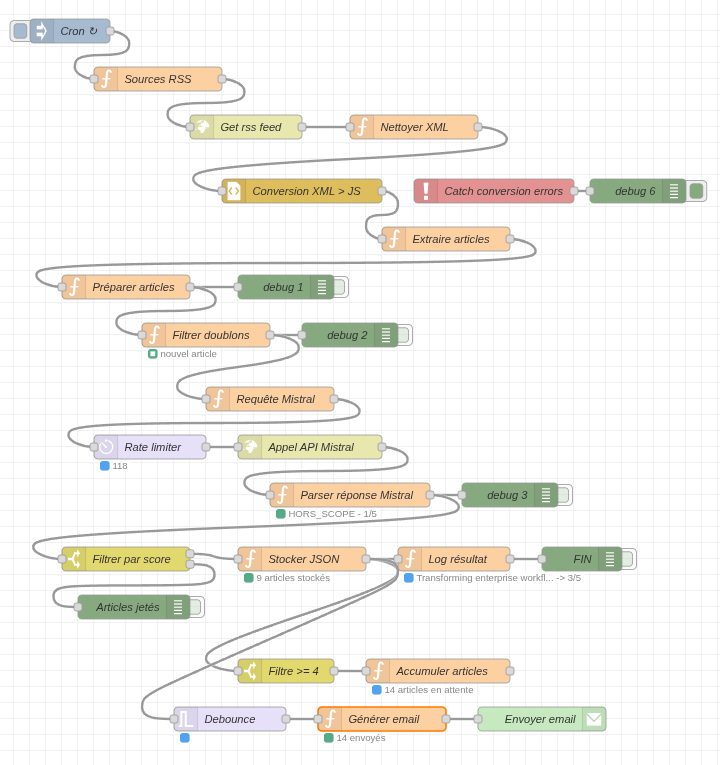

# Veille Tech automatisée avec Mistral AI

Développement d’un outil d’aggrégation et de synthèse de veille technologique.

## Ressources

- [Documentation Node-RED](https://nodered.org/docs/getting-started/local)
- [Documentation Node-RED Dashboard 2](https://dashboard.flowfuse.com/getting-started.html)
- [Documentation Node-RED Email](https://flows.nodered.org/node/node-red-node-email)
- [Console Mistral AI](https://console.mistral.ai/home)

## Note

Les différentes configurations doivent être adaptées en fonction du setup ainsi que des futures mises à jour des libs. Se référer aux documentations.

## Outils utilisés

### Node-RED → Automatisation



### Mistral AI → Synthèse et classification

La limitation en tokens n’est pas trop contraignante, c’est suffisant pour mon utilisation. De plus, la qualité des modèles est supérieure en comparaison de modèles implémentés localement.

## Configuration du flux Node-RED

### **Nodes nécessaires**

**Core (déjà installés)** :

- inject, function, http request, split, switch, debug

**À installer via Palette Manager** :

```text
@flowfuse/node-red-dashboard
node-red-node-email
```

## **Gestion de l'environnement**

**Variables d'env (clé API Mistral)** :

**Fichier ~/.node-red/settings.js** :

```js
functionGlobalContext: {
    MISTRAL_API_KEY: "ta_clé_ici",
    GOOGLE_APPS_PASSWORD: "ta_clé_ici",
}
```

**Accès dans function nodes** :

```js
const apiKey = global.get("MISTRAL_API_KEY");
```
